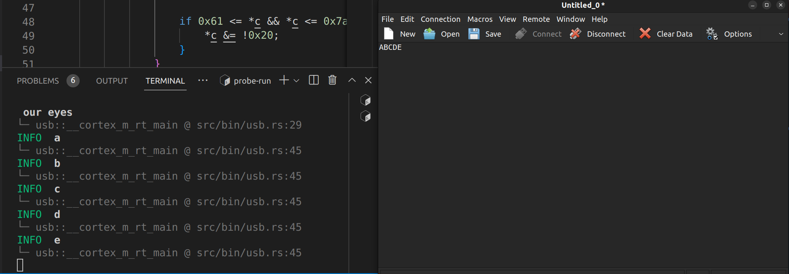

# USB playground

## Run

### Phase 1: coolterm

Works with coolterm and echoes back `a .. z` to capital letters
1. Go to the branch `coolterm`
2. start coolterm, identify your usb.
    Tips: run `ls -l /dev/serial/by-id` will return the port of the `usb-SEGGER_J-Link`. You need the other one (Usually `ACMx` on Linux, `x=0,1,2..`).
3. both USB and Seger probe must be connected with nRF52840!

4. Run `DEFMT_LOG=info cargo rb usb` in the firmware folder.
5. On coolterm, find right port (should be `/dev/ttyACM{0/1/2}` as per point 1. on Linux)
6. Type letters in coolterm, they should be echoed back in capital letters.

The example is taken from USB serial example in [`nrf-hal`](https://github.com/stm32-rs/stm32f1xx-hal/blob/master/examples/usb_serial.rs).



\* that info is in the `.cargo/config.toml` file but if it does not publish any letter, use explicit logging.

[.cargo/config.toml]
```toml
[env]
DEFMT_LOG="info"
```

### Phase 2: on_off_temp

This part works with a host (the computer). Type instructions at the terminal.
1. Go in the host folder `cd host` 
2. Run `cargo run --bin send`
3. Go to `cd firmware` and then run `DEFMT_LOG=info cargo rb usb`

The host is sending a serialized command to the firmware, with [Postcard](https://docs.rs/postcard/latest/postcard/).

❗The [serial busy error](https://github.com/serialport/serialport-rs/blob/6542d11235532ec78332e1e6b4986e73b8d55b11/src/lib.rs#L76)(`Error: Error { kind: Unknown, description: "Device or resource busy" }`) is an indication that the resource might still be used by coolterm.


### Phase 3: dioxus

That is WIP!

Works with a host program, turns on the light on and off and gives temperature with an GUI made (poorly) with Dioxus.
1. Host is in its folder: `cd host` and `cargo run --bin app`
2. The board: `cd firmware` and then `DEFMT_LOG=info cargo rb usb`
3. Click `on`, `off` or `temp` on the window to see the bord turning on the led, or turning off the led, or giving the temperature.

Error handling is still left as an exercise...
